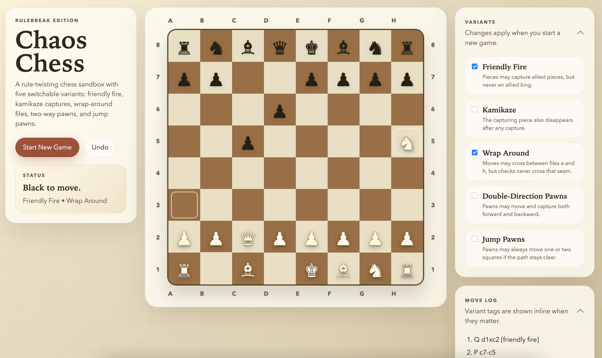

# Chaos Chess

*Rulebreak Edition*

`Chaos Chess` is a browser-based chess variant sandbox where you can mix friendly fire, kamikaze captures, wrap-around movement, and experimental pawn rules into standard chess.

## Preview



[Demo video](assets/chaos-chess-demo.webm)

The current build includes five toggleable rule twists:

- Friendly fire
- Kamikaze captures
- Wrap-around files
- Double-direction pawns
- Jump pawns

The app still runs as static browser files. For the best experience, serve the folder locally with `make serve`.

## Running It

Start a local server from the project root:

```bash
make serve
```

Then open `http://localhost:8000`.

Computer play is split across two backends in the current build: Stockfish for classic chess and a prototype search engine for variant games. Serving the app over `http://` or `https://` is still the most reliable way to enable the Stockfish path.

Run the automated rule tests with:

```bash
make test
```

Run a quick syntax check on the browser scripts with:

```bash
make check
```

Generate a small self-play dataset with:

```bash
make selfplay
```

Run a quick search-vs-heuristic benchmark with:

```bash
make benchmark
```

## What The App Does

- Renders a playable local two-player chess board in the browser.
- Adds an optional computer opponent with two backends: Stockfish for classic rules and a prototype search engine for variant rules.
- Lets you toggle any combination of the five variants, then restart the game with that rule set.
- Preserves standard check, checkmate, stalemate, castling, en passant, and promotion logic where those concepts still make sense.
- Uses a rules engine for legality. The UI only renders what the engine says is legal.
- Tags move-log entries when a move used variant-specific behavior such as wrap-around, friendly fire, or a kamikaze capture.

## Computer Play

- Classic chess uses a browser-based Stockfish worker.
- Variant games currently use a local prototype search engine that runs on top of the same legality engine as the UI.
- Both backends use the same runtime contract, which is the starting point for future search and ML-backed engines.
- The bundled Stockfish assets live in `vendor/stockfish/`, and the upstream GPL license text is included in `vendor/stockfish/Copying.txt`.
- The longer AI roadmap and architecture live in [docs/ai-architecture.md](docs/ai-architecture.md).

## ML Pipeline

- `src/position-encoder.js` converts board states into a fixed 842-feature vector for future model training.
- `scripts/selfplay.js` generates JSONL self-play data plus metadata using the current search backend.
- `scripts/benchmark.js` runs small head-to-head matches so search and heuristic versions can be compared quantitatively.
- Generated datasets are intended to feed the later value-model training stage described in [docs/ai-architecture.md](docs/ai-architecture.md).

## Rule Semantics

This section is the important part: each twist has a specific implementation, especially where your original idea leaves room for interpretation.

### 1. Friendly Fire

Definition used in this project:

- Any piece may capture an allied piece.
- No move may capture an allied king.
- The king is still allowed to move onto an allied non-king piece and remove it, as long as the destination square is not under attack.
- Friendly-fire captures still obey normal self-check rules. If capturing your own piece exposes your king, the move is illegal.

Tradeoff:

- This rule changes occupancy, not attack geometry. Your own pieces still block sliding attacks until they are actually removed.

### 2. Kamikaze

Definition used in this project:

- On any capture, the captured piece is removed.
- The capturing piece is also removed immediately.
- The destination square is left empty after the capture.
- There is no blast radius. This is a self-destruct rule, not full atomic chess.

Tradeoff:

- Kings cannot make capturing moves in kamikaze mode, because a legal move may not destroy your own king.
- A kamikaze capture can still be a strong defensive move if removing both pieces breaks an attack line.

### 3. Wrap-Around Files

Definition used in this project:

- Horizontal movement may cross between file `a` and file `h`.
- This applies to normal piece movement, captures, knight jumps, and pawn diagonals.
- Vertical wrapping does not exist. Only files wrap.

Important check nuance:

- The `a`/`h` seam is treated as a mobility seam, not an attack seam.
- In practice: a move may wrap, but check detection never wraps.
- So a rook on `a1` may move to `h1` in wrap mode, but it does not give check to a king on `h1` from `a1`.

Tradeoff:

- This is intentionally asymmetric. It matches your “move through it, but do not check through it” requirement.
- Because of that asymmetry, kings can sometimes stand in positions that would be threatened if wrap-around also counted as attack geometry.

### 4. Double-Direction Pawns

Definition used in this project:

- Pawns may move one square forward or one square backward.
- Pawn captures are also mirrored: they may capture diagonally forward or diagonally backward.
- Promotion still only happens on the opponent’s back rank, exactly like normal chess.

Tradeoff:

- This is implemented as a mirrored pawn move model, not just “backward non-capturing movement.”
- That keeps the rule internally consistent and prevents odd cases where a pawn can retreat but not fight while retreating.

### 5. Jump Pawns

Definition used in this project:

- A pawn may always move either one square or two squares in a straight line.
- The path must still be clear.
- The two-step is not restricted to the starting rank.

Tradeoff:

- En passant still exists. Because a pawn can now double-step from anywhere, en passant opportunities can also arise from anywhere.
- If double-direction pawns is also enabled, that logic applies in both allowed directions.

## Variant Interaction Notes

These combinations matter:

- `Friendly Fire + Check Rules`: removing your own blocker is legal only if your king remains safe afterward.
- `Kamikaze + Promotion`: if a pawn captures on the last rank in kamikaze mode, it still explodes, so no promoted piece remains on the board.
- `Wrap Around + Check`: movement may wrap, but kings never evaluate wrapped attacks as checks.
- `Double-Direction Pawns + Jump Pawns`: pawns may move one or two squares in either allowed direction, with normal path-clear requirements.
- `Jump Pawns + En Passant`: the engine stores the skipped square after any legal two-step pawn move, not just opening-rank moves.

## Standard Rules Kept

The following standard rules are still active:

- Check and self-check filtering
- Checkmate
- Stalemate
- Castling
- En passant
- Promotion

Promotion is chosen dynamically when a pawn reaches the last rank.

## Architecture

- `src/engine.js` contains the rules engine, legality checks, state transitions, and move descriptions.
- `src/classic-ai.js` wraps the browser-based Stockfish worker behind a small engine adapter.
- `src/computer-engines.js` contains the shared computer-engine contract plus the current Stockfish, heuristic baseline, and variant search backends.
- `src/app.js` handles DOM rendering, interaction, variant controls, and backend selection for computer play.
- `vendor/stockfish/` contains the vendored Stockfish browser build used for classic computer play.
- `tests/engine.test.js` and `tests/computer-engines.test.js` cover the rule layer and the first custom AI layer.
- `docs/ai-architecture.md` defines the planned path from heuristic engine to search and ML-backed variants.

## Why The Engine Is Structured This Way

The main design choice is that the variant behavior lives in move generation and state simulation, not in the UI:

- The UI never “guesses” whether a move should be legal.
- Check validation runs on the simulated post-move position, which is important for friendly-fire and kamikaze edge cases.
- Wrap-around movement and wrap-free check detection are intentionally separated so the “can move through it but not check through it” rule stays explicit instead of hidden inside a special-case hack.

## Things You May Want Next

Good follow-ups if you keep iterating:

- Add a custom position editor to test strange variant combinations faster.
- Add saved presets for named modes.
- Add move import/export or FEN-like snapshots for debugging.
- Strengthen the prototype variant search backend and then plug a learned evaluator into the same interface.
