# How The AI Works

This document explains the current Chaos Chess AI stack: how the project moves from a rule-aware chess engine to search, and from search into model-guided decision making.

In one sentence:

> Chaos Chess uses **search plus learned hints**, not one giant black-box model that directly "solves chess."

## Tiny Map

```text
Rules engine
    ->
Variant search
    ->
Learned hints
    ->
Better move ordering and better position scoring
```

## The Big Picture

```mermaid
flowchart TD
    A[Rule-aware chess engine<br/>"What moves are legal?"] --> B[Variant Search<br/>"Look ahead a few moves"]
    B --> C[Value Model<br/>"How good is this board?"]
    B --> D[Policy Model<br/>"Which moves look promising?"]
    B --> E[Candidate Score Model<br/>"Give each move a number"]
    B --> F[Pairwise Ranking Model<br/>"Is move A better than move B?"]
    C --> G[Hybrid Engine]
    D --> G
    E --> G
    F --> G
    G --> H[Hard-Position Mining<br/>"Study the mistakes"]
    H --> C
    H --> D
    H --> E
    H --> F
```

## 1. What This System Is, And Is Not

Chaos Chess does **not** currently use a true mathematical solver.

A true solver tries to prove the game result from a position:

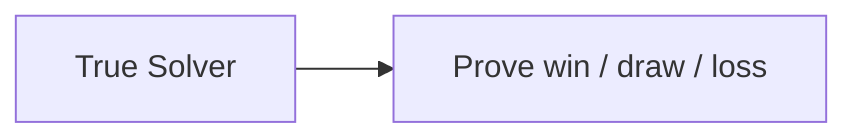

The current system is more practical:

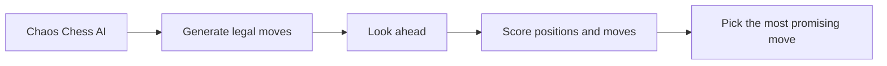

In other words, this is a **move-selection system**, not a solved game engine.

## 2. First Layer: Plain Search

The first useful engine followed a straightforward search loop:

1. list legal moves
2. try them
3. look a few turns ahead
4. score the resulting boards
5. keep the best move

Picture:

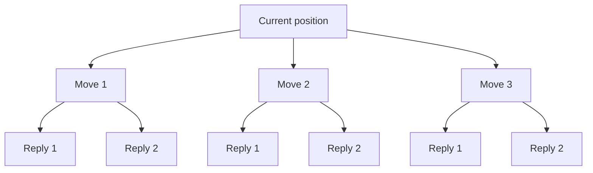

At a high level:

- the engine imagines several futures
- it scores those futures
- it chooses the move that leads to the best-looking future

This is the custom `Variant Search` engine.

## 3. Second Layer: Better Search Plumbing

Plain search is expensive, so the engine uses several techniques to make the same time budget go further.

Instead of exploring everything in a flat order, it tries to:

- look at promising moves first
- prune bad branches earlier
- reuse work from positions it has already seen

Picture:

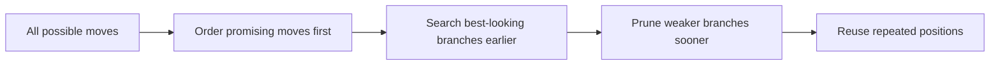

This is still the same underlying search idea. It is simply a more efficient version of it.

## 4. Third Layer: Value Model

The value model estimates one thing:

> "How good is this board position?"

Picture:

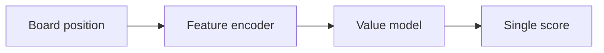

Instead of relying only on handwritten chess heuristics, search can also ask a learned model for a second opinion.

One way to think about it:

```text
Handwritten evaluator: "This looks a little better for White."
Value model:         "I have seen positions like this before; White is probably better."
```

## 5. Fourth Layer: Policy Model

The policy model answers a different question:

> "Which moves look promising from here?"

Picture:

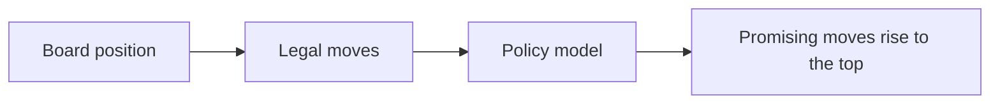

At runtime:

- it does **not** replace search
- it helps search decide where to look first

That is usually a safer role for ML than letting a model pick moves with no search behind it.

## 6. Fifth Layer: Candidate Score Model

The next step was to make the question even more direct.

Instead of asking:

- "Which move is best?"

we asked:

- "Give each move a score."

Picture:

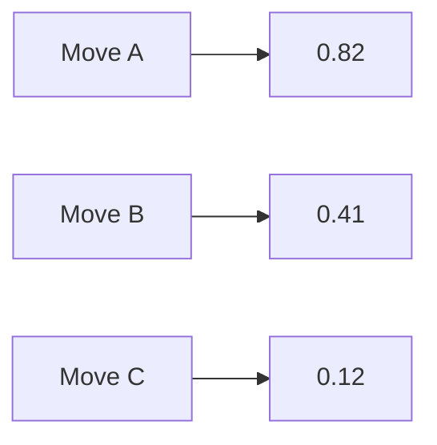

This matches search well because search often needs:

- a way to rank moves
- not a perfect final decision

## 7. Sixth Layer: Pairwise Ranking

Then the training objective became even more search-shaped:

> "Between move A and move B, which is better?"

Picture:

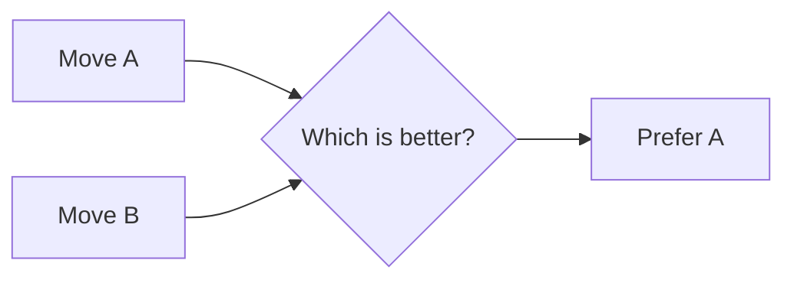

Why this matters:

- move ordering is often a relative comparison problem
- pairwise training matches that better than plain classification

Two variants were explored:

- `best_vs_rest`
  Compare the best teacher move to every other move.
- `all_pairs`
  Compare every meaningful pair of moves.

Picture:

```text
best_vs_rest:
  best vs move2
  best vs move3
  best vs move4

all_pairs:
  move1 vs move2
  move1 vs move3
  move1 vs move4
  move2 vs move3
  move2 vs move4
  move3 vs move4
```

## 8. Seventh Layer: Hard-Position Mining

One of the most important recent changes was hard-position mining.

Instead of training mostly on easy positions, the pipeline now asks:

- where does the current engine disagree with a stronger teacher?
- where does the teacher have a strong opinion?

Picture:

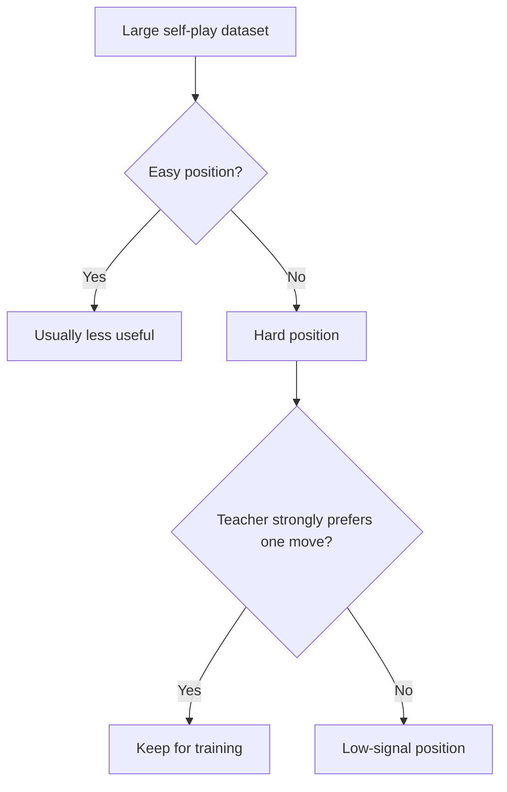

The core idea:

```text
Do not spend all your study time on problems you already get right.
Study the mistakes.
```

That is what hard-position mining does.

## 9. One Shared Model, Not 32 Separate Models

The project does **not** train one model per ruleset.

It uses one shared system that also sees the active rule flags.

Picture:

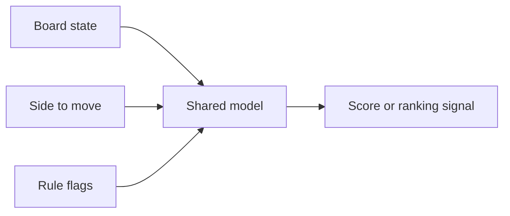

Why this matters:

- there are `32` rule combinations
- separate models would be messy
- one shared model is a better generalization story

## 10. How A Move Is Chosen Today

This is the simplest accurate picture of the current runtime:

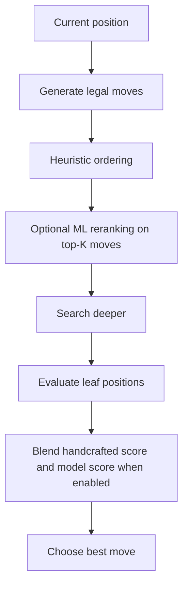

So the current engine is:

- not pure search
- not pure ML
- a hybrid

## 11. Why Offline Improvement Does Not Automatically Mean Better Play

This has been one of the central lessons of the project.

Picture:

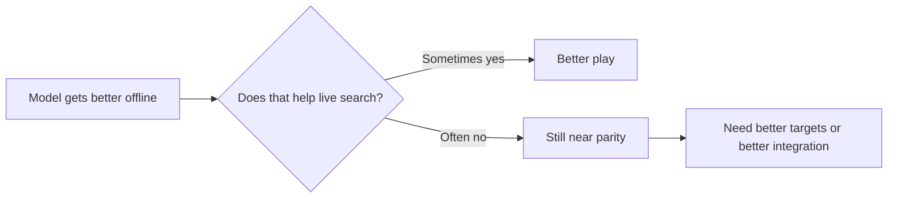

A model can get better at:

- copying the teacher
- matching teacher scores
- ranking moves offline

without clearly improving the live engine.

That is why we keep doing:

- sequential benchmarks
- color-balanced sweeps
- independent confirmatory runs

## 12. Current Status

Short version:

```text
Search:                   works
Value model:              works offline
Policy model:             works offline
Candidate scoring:        works offline
Pairwise ranking:         works offline
Hard-position mining:     works as a data filter
Clear live strength gain: not proven yet
```

Picture:

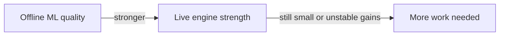

That does **not** mean the work failed.

It means:

- the ML stack is real
- the experiments are real
- the repo shows thoughtful iteration
- the hardest remaining problem is turning offline signal into stable search improvement

## 13. Practical Summary

This is the cleanest way to summarize the system:

```text
1. We built a rules engine.
2. We built a search engine on top of it.
3. We trained models to help search.
4. We trained newer models to rank moves more directly.
5. We started training on the engine's mistakes instead of easy positions.
6. We measured everything honestly.
```

That is the Chaos Chess AI story.
